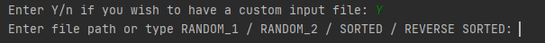
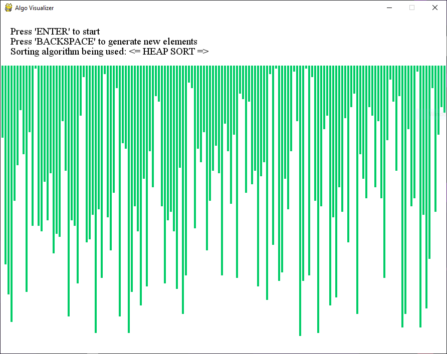
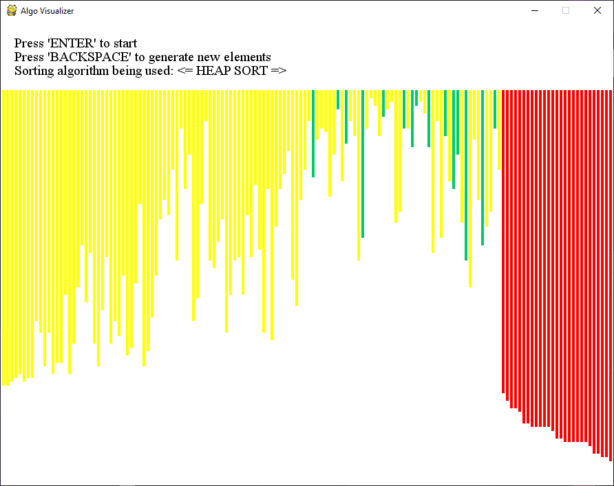
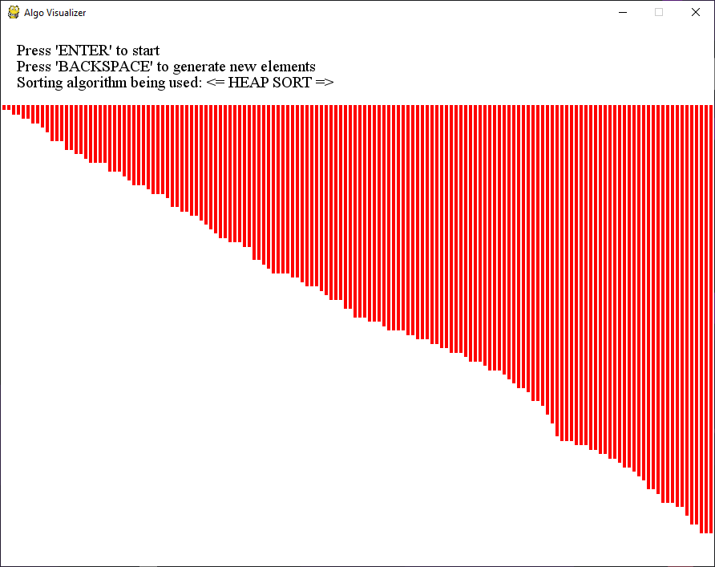

Algo Visualizer
============

Visual tool to aid in understanding algorithms. Currently does: 
* Heap sort
* Insertion sort

## Development

 * Written in Python 3
 * Uses PyGame for GUI building
 
## Screenshots

### User Input @Launch

### Beginning State

### In Progress State

### Ending State

